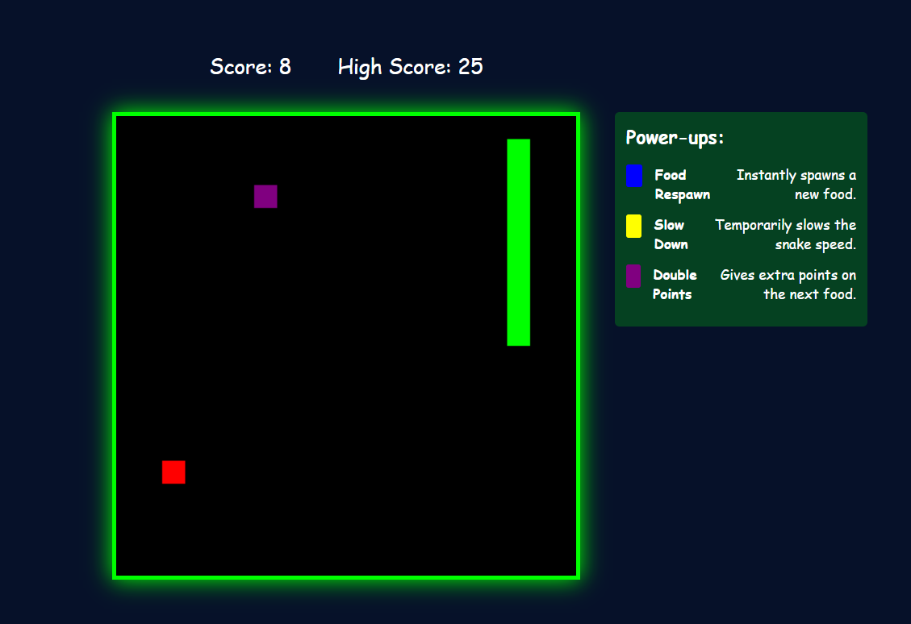

# Retro Snake Game

This is a **Retro style Snake Game**! A classic arcade-style game built with **HTML, CSS, and JavaScript**, featuring power-ups, speed adjustments, and a pixelated retro theme.

---


## How to Play
- Use **Arrow Keys** to move the snake.
- Eat the **red food** to grow and increase your score.
- **Avoid collisions** with the walls and yourself!
- Collect **power-ups** for special effects:
  - 🟦 **Food Respawn** – Instantly spawns a new food item.
  - 🟨 **Slow Down** – Temporarily slows the snake down.
  - 🟪 **Double Points** – Doubles the score of the next food eaten.
- Press the **Space Bar** to pause the game. Press again to resume.

---

## Installation & Setup
1. **Clone the Repository** (or download the project files):
   ```sh
   git clone https://github.com/your-repo/snake-game.git
2. Open **index.html** in a web browser.
3. Play and enjoy!
